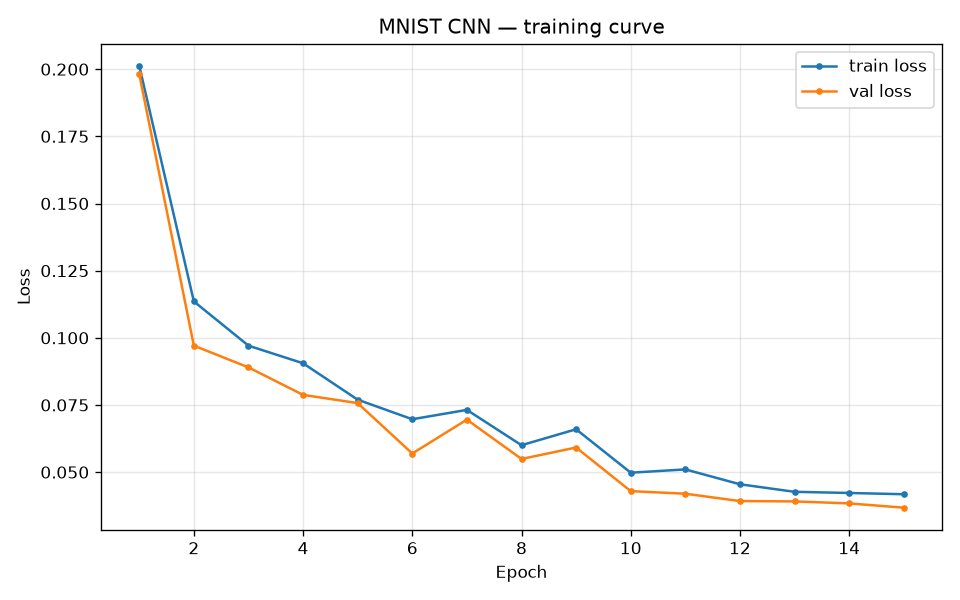
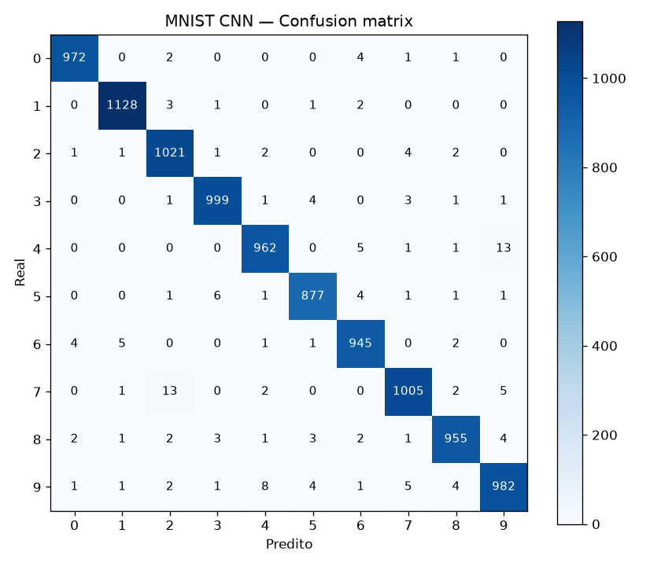
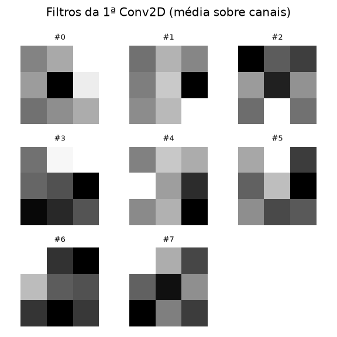

# pico-nn 🧠

[](https://github.com/adamgabriel702/neural-net-from-scratch/actions/workflows/tests.yml)
[](https://github.com/adamgabriel702/neural-net-from-scratch)
[](LICENSE)
[](tests/)
[](requirements.txt)

Rede neural **implementada do zero com NumPy** — sem PyTorch, sem TensorFlow, sem autograd, sem mágica.

O objetivo é didático e de portfólio: escrever cada equação do backpropagation à mão, com **verificação de gradiente numérico** para provar que a matemática está correta.

---

## 🎯 Resultados

CNN de 2 camadas convolucionais treinada **do zero, em CPU, apenas com NumPy**:

| Modelo | Dataset | Acurácia |
|---|---|---|
| MLP `784→128→64→10` | MNIST (10k train) | **~97%** |
| CNN `Conv(8)→Conv(16)→FC(64)→10` | MNIST (8k train) | **~97.7%** |
| CNN + **data augmentation** | MNIST (8k train) | **98.5%** |

Tudo com `BatchNorm`, `BatchNorm2D`, `Dropout`, `Adam`, `CosineAnnealing`,
`EarlyStopping`, `ModelCheckpoint` e `DataLoader` com augmentation —
todos implementados manualmente.

### Curva de treino



### Learning rate schedule (Cosine Annealing)


### Matriz de confusão (test set — 10.000 imagens)



### Filtros aprendidos pela primeira `Conv2D`



---

## ✨ Features

- **API estilo Keras**: `Sequential`, `add`, `compile`, `fit`, `predict`
- **Camadas**: `Dense`, `ActivationLayer`, `Dropout`, `BatchNorm`, `BatchNorm2D`, `Conv2D`, `MaxPool2D`, `Flatten`
- **Ativações**: Sigmoid, ReLU, Tanh, Softmax, Linear
- **Losses**: MSE, Binary Cross-Entropy, Categorical Cross-Entropy
- **Otimizadores**: SGD, Momentum, Adam (com bias correction)
- **Schedulers**: `StepLR`, `ExponentialLR`, `CosineAnnealing`, `WarmupCosine`
- **Callbacks**: `EarlyStopping`, `ModelCheckpoint`, `History`
- **DataLoader** com shuffle, batching e `transform` opcional
- **Data augmentation**: `Compose`, `RandomHorizontalFlip`, `RandomShift`, `RandomRotation90`, `GaussianNoise`
- **Métricas**: accuracy, confusion matrix, precision / recall / F1
- **Fusão Softmax + CCE** para gradiente estável
- **Convolução via im2col + matmul** — mesma técnica das libs de produção
- **Modo treino / inferência** (Dropout e BatchNorm)
- **Save / Load** em `.npz` (params + buffers)
- **Visualização** com matplotlib (loss curves, confusion matrix, filtros)
- **Datasets** prontos (MNIST com download automático, blobs sintéticos)
- **Testes** com `pytest` — incluindo **verificação de gradiente numérico**
- **CI** via GitHub Actions (Python 3.10, 3.11, 3.12 + smoke test + build)

---

## 📦 Instalação

### Direto do GitHub (funciona agora)

```bash
pip install git+https://github.com/adamgabriel702/neural-net-from-scratch.git
```

### Com visualizações (matplotlib)

```bash
pip install "pico-nn[viz] @ git+https://github.com/adamgabriel702/neural-net-from-scratch.git"
```

### Do PyPI (em breve)

```bash
pip install pico-nn
```

### Código-fonte (para desenvolvimento)

```bash
git clone https://github.com/adamgabriel702/neural-net-from-scratch
cd neural-net-from-scratch
pip install -e ".[dev]"
```

Única dependência de runtime: `numpy`. `matplotlib`, `scikit-learn` e
`pytest` são usados apenas em exemplos, testes e visualização.

---

## 🚀 Uso rápido

```python
import numpy as np
from nn import Sequential, Dense, ActivationLayer, Adam

X = np.array([[0, 0], [0, 1], [1, 0], [1, 1]], dtype=float)
y = np.array([[0], [1], [1], [0]], dtype=float)

model = Sequential()
model.add(Dense(2, 8, init="xavier"))
model.add(ActivationLayer("tanh"))
model.add(Dense(8, 1, init="xavier"))
model.add(ActivationLayer("sigmoid"))

model.compile(loss="bce", optimizer=Adam(lr=0.01))
model.fit(X, y, epochs=200, batch_size=4)

print(np.round(model.predict(X), 3).ravel())
# [0.02 0.98 0.98 0.02]
```

---

## 🖼️ CNN no MNIST — exemplo completo

```python
from nn import (
    Sequential, Conv2D, BatchNorm2D, MaxPool2D, Flatten, Dense,
    ActivationLayer, Dropout, Adam, CosineAnnealing,
    EarlyStopping, ModelCheckpoint, DataLoader,
    Compose, RandomShift, GaussianNoise,
)
from nn.datasets import load_mnist
from nn.utils import one_hot, train_test_split, evaluate_and_report

# Carrega MNIST — download automático na primeira vez
Xtr, ytr, Xte, yte = load_mnist(flatten=False)   # (N, 1, 28, 28)
Xtr, ytr = Xtr[:8000], ytr[:8000]

ytr_oh = one_hot(ytr, 10)
yte_oh = one_hot(yte, 10)
Xtr, Xval, ytr_oh, yval_oh = train_test_split(Xtr, ytr_oh, test_size=0.1)

# Arquitetura
model = Sequential()
model.add(Conv2D(1, 8, kernel_size=3, padding=1, init="he"))
model.add(BatchNorm2D(8))
model.add(ActivationLayer("relu"))
model.add(MaxPool2D(2))
model.add(Conv2D(8, 16, kernel_size=3, padding=1, init="he"))
model.add(BatchNorm2D(16))
model.add(ActivationLayer("relu"))
model.add(MaxPool2D(2))
model.add(Flatten())
model.add(Dense(16 * 7 * 7, 64, init="he"))
model.add(ActivationLayer("relu"))
model.add(Dropout(0.3))
model.add(Dense(64, 10))
model.add(ActivationLayer("softmax"))

# Data augmentation — sem flip: 6↔9 e 2↔5 se confundem
aug = Compose([
    RandomShift(max_shift=2, seed=0),
    GaussianNoise(sigma=0.05, seed=0),
])
train_loader = DataLoader(Xtr, ytr_oh, batch_size=32,
                          shuffle=True, transform=aug, seed=0)

# Treino com scheduler + callbacks
opt = Adam(lr=2e-3)
model.compile(loss="cce", optimizer=opt)
scheduler = CosineAnnealing(opt, t_max=15, eta_min=1e-5)

model.fit(
    train_loader,
    epochs=15,
    validation_data=(Xval, yval_oh),
    scheduler=scheduler,
    callbacks=[
        EarlyStopping(monitor="val_loss", patience=4),
        ModelCheckpoint("checkpoints/mnist_cnn_best.npz", monitor="val_loss"),
    ],
)

model.load("checkpoints/mnist_cnn_best.npz")
evaluate_and_report(model, Xte, yte, yte_oh, title="MNIST CNN")
```

Ou rode direto:

```bash
python examples/mnist_cnn.py
```

---

## 📚 Exemplos incluídos

| Arquivo | Descrição | Acurácia |
|---|---|---|
| `examples/xor.py`       | Clássico XOR — sanity check | 100% |
| `examples/iris.py`      | Multiclasse com Softmax + CCE | ~97% |
| `examples/mnist.py`     | MLP com BatchNorm + Dropout | ~97% |
| `examples/mnist_cnn.py` | CNN com Conv2D + BatchNorm2D + augmentation | **98.5%** |

---

## 🧪 Testes

```bash
pytest
```

**68 testes** cobrindo:

- Formas (shapes) e comportamento de cada camada
- Ativações e losses
- **Verificação de gradiente numérico** contra backprop analítico para:
  - `Dense` × (Sigmoid, Tanh, ReLU) × (MSE, BCE, CCE)
  - `Conv2D` com diferentes `padding`, `stride`, canais
  - `BatchNorm` e `BatchNorm2D`
- Convergência em XOR e em blobs multiclasse
- Round-trip de `save` / `load`
- Schedulers e callbacks
- `DataLoader` e todas as transforms de augmentation

### Por que testes de gradiente?

Redes neurais **podem treinar "por acaso"** mesmo com backprop errado, porque
otimizadores como Adam normalizam cada parâmetro pela sua própria magnitude
RMS e acabam compensando erros sistemáticos de escala. O teste de gradiente
numérico elimina essa classe de bugs comparando o gradiente analítico com a
derivada por diferenças finitas:

```
dL/dθ ≈ (L(θ + ε) − L(θ − ε)) / (2ε)
```

Se a razão entre os dois for maior que `1e-5` em qualquer parâmetro, o
backprop está errado.

Este projeto já pegou **três bugs reais** que o treino escondia:

1. `/m` duplicado entre `Loss.backward` e `Dense.backward` (gradiente `m×` maior)
2. `/N` faltando em `Conv2D.backward` (mesma classe de bug)
3. `/N` faltando em `BatchNorm.dgamma/dbeta`

Todos silenciosos sob Adam. Todos pegos pelo teste numérico.

---

## 📓 Notebook didático

Para quem quer **entender** o backprop, e não só usar:

```bash
pip install jupytext
jupytext --to notebook notebooks/backprop_from_scratch.py
```

Ou abra `notebooks/backprop_from_scratch.ipynb` direto.

O notebook deriva à mão:

- Gradiente de um neurônio individual
- Gradiente de uma camada densa
- Backprop em uma rede de duas camadas
- Verificação numérica contra diferenças finitas
- Treino no XOR com backprop manual
- Comparação com o pacote `nn`

Toda derivação é validada numericamente dentro do próprio notebook.

---

## 📈 Data augmentation

O treino da CNN usa `RandomShift(±2 px)` + `GaussianNoise(0.05)` via
`DataLoader`. Isso levou a acurácia de **97.7% → 98.5%** sem mudar a
arquitetura nem o número de épocas.

`RandomHorizontalFlip` está disponível no pacote mas **não é usado no MNIST**,
porque `6↔9` e `2↔5` se confundem com flip horizontal. Está lá para outros
datasets onde orientação não importa.

```python
from nn import Compose, RandomHorizontalFlip, RandomShift, GaussianNoise

aug = Compose([
    RandomHorizontalFlip(p=0.5),   # NÃO recomendado no MNIST
    RandomShift(max_shift=2),
    GaussianNoise(sigma=0.05),
])
```

O `transform` só roda em batches de treino — validação e teste nunca são
aumentados.

---

## 🏗️ Estrutura do projeto

```
neural-net-from-scratch/
├── nn/
│   ├── __init__.py
│   ├── py.typed           # PEP 561
│   ├── activations.py     # sigmoid, relu, tanh, softmax, linear
│   ├── losses.py          # MSE, BCE, CCE + derivadas (sum-reduced)
│   ├── layers.py          # Dense, Activation, Dropout, BatchNorm,
│   │                      # BatchNorm2D, Conv2D, MaxPool2D, Flatten
│   ├── optimizers.py      # SGD, Momentum, Adam
│   ├── schedulers.py      # StepLR, ExponentialLR, CosineAnnealing, WarmupCosine
│   ├── callbacks.py       # EarlyStopping, ModelCheckpoint, History
│   ├── data.py            # DataLoader (batching + shuffle + transform)
│   ├── augmentation.py    # Compose, RandomFlip, RandomShift, ...
│   ├── metrics.py         # accuracy, confusion matrix, P/R/F1
│   ├── model.py           # Sequential
│   ├── datasets.py        # MNIST, blobs sintéticos
│   ├── visualization.py   # loss curves, confusion matrix, filtros
│   └── utils.py           # split, standardize, one_hot, batch_iterator
├── examples/
│   ├── xor.py
│   ├── iris.py
│   ├── mnist.py
│   └── mnist_cnn.py
├── notebooks/
│   ├── backprop_from_scratch.py      # jupytext
│   └── backprop_from_scratch.ipynb   # gerado
├── tests/
│   ├── conftest.py
│   ├── helpers.py         # check_gradients (numérico)
│   ├── test_activations.py
│   ├── test_losses.py
│   ├── test_layers.py
│   ├── test_conv.py
│   ├── test_batchnorm.py
│   ├── test_model.py
│   ├── test_gradients.py
│   ├── test_schedulers.py
│   └── test_augmentation.py
├── figures/               # imagens geradas pelos exemplos
├── .github/workflows/
│   ├── tests.yml          # test matrix + build + smoke
│   └── publish.yml        # PyPI via Trusted Publishing
├── pyproject.toml
├── MANIFEST.in
├── requirements.txt
├── LICENSE
└── README.md
```

---

## 📐 Detalhes matemáticos

### Backpropagation (regra da cadeia)

Para uma camada densa `Z = XW + b` seguida de ativação `A = f(Z)`:

```
∂L/∂W = Xᵀ · dZ / m
∂L/∂b = Σ dZ / m
∂L/∂X = dZ · Wᵀ
```

onde `dZ = dA ⊙ f'(Z)`.

### Convenção de escala

As derivadas em `losses.py` são **sum-reduced** (não dividem por `m`).
A divisão por `m` acontece somente em `Dense.backward`, `Conv2D.backward` e
`BatchNorm.backward`, aplicada aos gradientes dos **parâmetros** (`dW`, `db`,
`dgamma`, `dbeta`).

O gradiente da **entrada** (`dX`) é sempre per-sample para não ser dividido
duas vezes ao longo da cadeia. É o que os testes de gradiente verificam.

### Softmax + Categorical Cross-Entropy (fusão)

Se a última camada é Softmax e a loss é CCE, o gradiente combinado em
relação a `Z` simplifica para:

```
∂L/∂Z = (A − y)
```

Isso evita o Jacobiano `d×d` do Softmax puro e melhora a estabilidade
numérica. O `Sequential` detecta essa combinação automaticamente em
`compile()` e pula a camada de ativação no backward.

### Batch Normalization

Forward (treino):

```
μ = mean(X)
σ² = var(X)
x̂ = (X − μ) / √(σ² + ε)
y = γ · x̂ + β
```

No inference, usa médias móveis (`running_mean`, `running_var`) atualizadas
com momentum durante o treino. O backward segue a derivação original do
paper (Ioffe & Szegedy, 2015).

### Convolução 2D

Forward via **im2col + matmul**:

1. Extrai janelas deslizantes da entrada em uma matriz `(N, C·kH·kW, H_out·W_out)`
2. Achata os filtros em `(C_out, C·kH·kW)`
3. Multiplica: `out = W_col @ cols`
4. Remonta em `(N, C_out, H_out, W_out)`

Backward usa `col2im` (inverso do im2col, somando sobre janelas sobrepostas)
para calcular `∂L/∂X`.

### Adam

```
mₜ = β₁ · mₜ₋₁ + (1 − β₁) · g
vₜ = β₂ · vₜ₋₁ + (1 − β₂) · g²
m̂ₜ = mₜ / (1 − β₁ᵗ)
v̂ₜ = vₜ / (1 − β₂ᵗ)
θₜ = θₜ₋₁ − lr · m̂ₜ / (√v̂ₜ + ε)
```

### Cosine Annealing

```
lr(t) = eta_min + 0.5 · (base_lr − eta_min) · (1 + cos(π · t / T))
```

---

## 🔬 O que dá pra aprender lendo o código

- Como o **backpropagation** funciona de verdade, sem `autograd`
- Como implementar **convolução** sem `im2col` mágico de biblioteca
- Como **BatchNorm** e **Dropout** se comportam diferente em treino vs. inferência
- Como **fundir softmax + CCE** evita instabilidade numérica
- Como escrever **testes de gradiente** que pegam bugs reais de escala
- Como estruturar um **framework de ML** com API limpa em ~1200 linhas
- Como **empacotar** um projeto Python com `pyproject.toml` e publicá-lo

---

## 🗺️ Roadmap

- [x] MLP + backpropagation
- [x] Adam, SGD, Momentum
- [x] Softmax + CCE (com fusão)
- [x] Dropout (invertido)
- [x] BatchNorm + BatchNorm2D
- [x] Conv2D + MaxPool2D + Flatten
- [x] Save / Load
- [x] LR Schedulers (StepLR, Cosine, Warmup)
- [x] Callbacks (EarlyStopping, ModelCheckpoint)
- [x] DataLoader + data augmentation
- [x] Datasets + utils reusáveis
- [x] Visualizações (loss, confusão, filtros)
- [x] Testes com verificação de gradiente (68 testes)
- [x] CI no GitHub Actions + smoke + build
- [x] Notebook didático derivando o backprop
- [ ] Publicação no PyPI
- [ ] RNN simples (`SimpleRNN` + `LSTM`)
- [ ] Mixed precision (float32)

---

## 🤝 Contribuindo

Pull requests são bem-vindos. Para mudanças grandes, abra uma issue primeiro
para alinharmos o escopo.

```bash
git clone https://github.com/adamgabriel702/neural-net-from-scratch
cd neural-net-from-scratch
pip install -e ".[dev]"
pytest
```

---

## 📄 Licença

MIT — veja [LICENSE](LICENSE).

---

## 🙏 Referências

- Ioffe, S., & Szegedy, C. (2015). *Batch Normalization: Accelerating Deep Network Training by Reducing Internal Covariate Shift.*
- Srivastava, N. et al. (2014). *Dropout: A Simple Way to Prevent Neural Networks from Overfitting.*
- Kingma, D., & Ba, J. (2015). *Adam: A Method for Stochastic Optimization.*
- Loshchilov, I., & Hutter, F. (2016). *SGDR: Stochastic Gradient Descent with Warm Restarts.*
- Goodfellow, I., Bengio, Y., & Courville, A. (2016). *Deep Learning.* MIT Press.